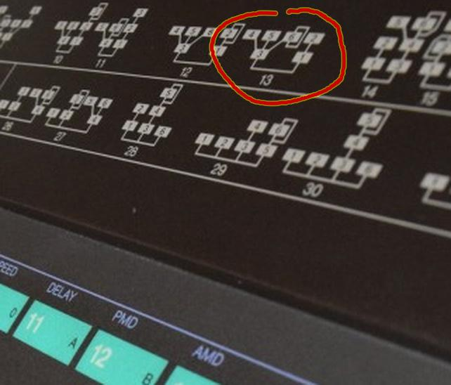
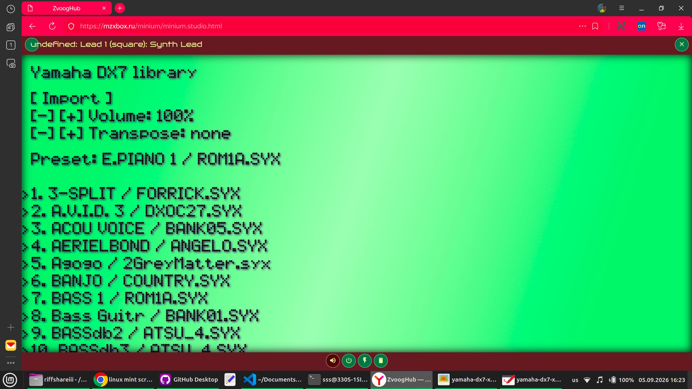

# FM-синтез звука в браузере. Часть 2

Рассмотрим FM-синтез на реальном примере. Сделаем эмулятор синтезатора Yamaha DX7 и добавим в него возможность читать картриджы с инструментами.


первая часть статьи здесь - https://habr.com/ru/articles/1052640/

## Немного о синтезаторе

Yamaha DX7 появился в 1983г. За счёт широких возможностей настройки звуков и низкой цены стал очень широко применяться. Половина поп-музыки 80-х годов прошлого века написана с его использованием.

Внутри устройства 6 генераторов синусоиды. Они могут соединяться друг с другом в 32 презаданные схемы (на картинке синтезатора выше они нарисованы на корпусе).
Каждый генератор имеет собственную частоту (кратную нажатой клавише или постоянную) и огибающую. 

При соединении генераторы создают фазовую модуляцию, что позволяет менять звук в широких пределах. Исторически сложилось, что это называется FM-синтезом (т.е. аплитудно-частотным синтезом), хотя это и некорректно.

Подробней о внутреннем устройстве пресетов для Yamaha DX7 можно прочитать здесь - https://www.muzines.co.uk/search/understanding%20the%20dx7

За прошедшее время для этого синтезатора наделали несметное количество инструментов от гитар с органами до барабанов. Если погуглить ( https://ya.ru/search/?text=dx7+syx ) то можно найти достаточно много с хорошим звучанием.

## Эмуляция DX7

Сделаем эмулятор в виде плагина для Minium Studio чтоб можно было не просто тыкнуть кнопку для воспроизведения единичного звука, а послушать звучание пресетов в полноценной музыкальной композиции.

Весь код для воспроизведения звука заданного пресетом убирается в 300 строчек, посмотреть можно [тут - dx7synth.ts](https://github.com/surikov/webaudiopluginexample/blob/main/dx7/synth/source/dx7synth.ts)

### Загрузка пресетов из файла

Формат файлов картриджей с инструментами (обычно это *.syx) можно посмотреть здесь - https://github.com/asb2m10/dexed/blob/master/Documentation/sysex-format.txt

Параметры пресетов зависят от используемых в DX7 микросхем и поэтому выглядят ужасно. Например так описываются параметры ADSR-огибающей

```
Огибающие в синтезаторах Yamaha DX7 отличаются от классических ADSR-огибающих, но не настолько сильно, как может показаться. Каждая из четырех точек имеет два редактируемых параметра: скорость и уровень, при этом скорость управляет временем, необходимым для перехода огибающей от одной точки к следующей, а уровень — громкостью этой точки.

Самое запутанное — это то, что регуляторы скорости инвертированы, поэтому на DX7 для увеличения времени огибающей необходимо опустить ползунок. Кроме того, уровень затухания также устанавливает начальный уровень. Причём повышение уровня проходит экспоненциально, а понижение - линейно.
```

В таком виде использовать пресеты неудобно. Выбросим малозначимые параметры, а остальные будем конвертировать в человеческий вид.
Структура данных каждого пресета в эмуляторе выглядит так:

```TypeScript
type SynthPreset = {
	label: string; //название пресета
	mixID: number; //номер схемы соединения операторов
	operators: {   //массив на 6 операторов
		constantFrequency: number; //или константная частота
		frequencyRatio: number;    //или делитель частоты играемой ноты
		detune: number; //смещение частоты в полутонах
		volume: number;
		envelope: { //огибающая ADSR, длительность и уровни громкости
			attack: { duration: number; values: number[]; }; //атака
			decay: { duration: number; values: number[]; };  //спад
			sustain: { duration: number; values: number[]; };//основной
			release: number; //время до полного затухания
			}; 
		}[];
	feedbackRatio: number;  //сила модуляции в кольцевом соединении
	modulationRatio: number;//сила модуляции в обычном соединении
};
```

_как видно, параметров для такого разнообразного зучания синтезатора очень немного. Даже как-то странно._

Код парсинга двоичных файлов пресетов в структуру находится в [loadersys.ts](https://github.com/surikov/webaudiopluginexample/blob/main/dx7/ui/src/loadersys.ts)

### Описание работы синтезатора

Код для воспроизведения звука:

<details>

<summary>dx7synth.ts</summary>

```TypeScript
function newDX7FMSynth1(): MZXBX_AudioPerformerPlugin {
	console.log('create newDX7FMSynth1 v1.02');
	let matrixConnectionAlgorithmsDX7: ConnectionSchemeDX7[] = [
		{ outputMix: [0, 2], modulationMatrix: [[1], [], [3], [4], [5], []], feedbackMatrix: [[], [], [], [], [], [5]] }
		, { outputMix: [0, 2], modulationMatrix: [[1], [], [3], [4], [5], []], feedbackMatrix: [[], [1], [], [], [], []] }
		, { outputMix: [0, 3], modulationMatrix: [[1], [2], [], [4], [5], []], feedbackMatrix: [[], [], [], [], [], [5]] }
		, { outputMix: [0, 3], modulationMatrix: [[1], [2], [], [4], [5], []], feedbackMatrix: [[], [], [], [], [], [3]] }
		, { outputMix: [0, 2, 4], modulationMatrix: [[1], [], [3], [], [5], []], feedbackMatrix: [[], [], [], [], [], [5]] }
		, { outputMix: [0, 2, 4], modulationMatrix: [[1], [], [3], [], [5], []], feedbackMatrix: [[], [], [], [], [], [4]] }
		, { outputMix: [0, 2], modulationMatrix: [[1], [], [3, 4], [], [5], []], feedbackMatrix: [[], [], [], [], [], [5]] }
		, { outputMix: [0, 2], modulationMatrix: [[1], [], [3, 4], [], [5], []], feedbackMatrix: [[], [], [], [3], [], []] }
		, { outputMix: [0, 2], modulationMatrix: [[1], [], [3, 4], [], [5], []], feedbackMatrix: [[], [1], [], [], [], []] }
		, { outputMix: [0, 3], modulationMatrix: [[1], [2], [], [4, 5], [], []], feedbackMatrix: [[], [], [2], [], [], []] }
		, { outputMix: [0, 3], modulationMatrix: [[1], [2], [], [4, 5], [], []], feedbackMatrix: [[], [], [], [], [], [5]] }
		, { outputMix: [0, 2], modulationMatrix: [[1], [], [3, 4, 5], [], [], []], feedbackMatrix: [[], [1], [], [], [], []] }
		, { outputMix: [0, 2], modulationMatrix: [[1], [], [3, 4, 5], [], [], []], feedbackMatrix: [[], [], [], [], [], [5]] }
		, { outputMix: [0, 2], modulationMatrix: [[1], [], [3], [4, 5], [], []], feedbackMatrix: [[], [], [], [], [], [5]] }
		, { outputMix: [0, 2], modulationMatrix: [[1], [], [3], [4, 5], [], []], feedbackMatrix: [[], [1], [], [], [], []] }
		, { outputMix: [0], modulationMatrix: [[1, 2, 4], [], [3], [], [5], []], feedbackMatrix: [[], [], [], [], [], [5]] }
		, { outputMix: [0], modulationMatrix: [[1, 2, 4], [], [3], [], [5], []], feedbackMatrix: [[], [1], [], [], [], []] }
		, { outputMix: [0], modulationMatrix: [[1, 2, 3], [], [2], [], [5], []], feedbackMatrix: [[], [], [], [4], [], []] }
		, { outputMix: [0, 3, 4], modulationMatrix: [[1], [2], [], [5], [5], []], feedbackMatrix: [[], [], [], [], [], [5]] }
		, { outputMix: [0, 1, 3], modulationMatrix: [[2], [2], [], [4, 5], [], []], feedbackMatrix: [[], [], [2], [], [], []] }
		, { outputMix: [0, 1, 3, 4], modulationMatrix: [[2], [2], [], [5], [5], []], feedbackMatrix: [[], [], [2], [], [], []] }
		, { outputMix: [0, 2, 3, 4], modulationMatrix: [[1], [], [5], [5], [5], []], feedbackMatrix: [[], [], [], [], [], [5]] }
		, { outputMix: [0, 1, 3, 4], modulationMatrix: [[], [2], [], [5], [5], []], feedbackMatrix: [[], [], [], [], [], [5]] }
		, { outputMix: [0, 1, 2, 3, 4], modulationMatrix: [[], [], [5], [5], [5], []], feedbackMatrix: [[], [], [], [], [], [5]] }
		, { outputMix: [0, 1, 2, 3, 4], modulationMatrix: [[], [], [], [5], [5], []], feedbackMatrix: [[], [], [], [], [], [5]] }
		, { outputMix: [0, 1, 3], modulationMatrix: [[], [2], [], [4, 5], [], []], feedbackMatrix: [[], [], [], [], [], [5]] }
		, { outputMix: [0, 1, 3], modulationMatrix: [[], [2], [], [4, 5], [], []], feedbackMatrix: [[], [], [2], [], [], []] }
		, { outputMix: [0, 2, 5], modulationMatrix: [[1], [], [3], [4], [], []], feedbackMatrix: [[], [], [], [], [4], []] }
		, { outputMix: [0, 1, 2, 4], modulationMatrix: [[], [], [3], [], [5], []], feedbackMatrix: [[], [], [], [], [], [5]] }
		, { outputMix: [0, 1, 2, 5], modulationMatrix: [[], [], [3], [4], [], []], feedbackMatrix: [[], [], [], [], [4], []] }
		, { outputMix: [0, 1, 2, 3, 4], modulationMatrix: [[], [], [], [], [5], []], feedbackMatrix: [[], [], [], [], [], [5]] }
		, { outputMix: [0, 1, 2, 3, 4, 5], modulationMatrix: [[], [], [], [], [], []], feedbackMatrix: [[], [], [], [], [], [5]] }
	];
	class MiniumFMOperator {
		audioContext: AudioContext;
		operatorOut: GainNode;
		feedbackLevel: GainNode;
		phaseDelay: DelayNode;
		carrier: OscillatorNode;
		modulationLevel: GainNode;
		envelope: GainNode;
		constructor(cntxt: AudioContext) {
			this.audioContext = cntxt;
			
			this.operatorOut = this.audioContext.createGain();
			this.modulationLevel = this.audioContext.createGain();
			this.feedbackLevel = this.audioContext.createGain();
			this.envelope = this.audioContext.createGain();
			this.phaseDelay = this.audioContext.createDelay();
			this.carrier = this.audioContext.createOscillator();

			this.envelope.connect(this.operatorOut);
			this.phaseDelay.connect(this.envelope);
			this.modulationLevel.connect(this.phaseDelay.delayTime);
			this.feedbackLevel.connect(this.phaseDelay.delayTime);
			this.carrier.connect(this.phaseDelay);

			this.operatorOut.gain.value = 0;
			this.phaseDelay.delayTime.value = 0;
			this.envelope.gain.value = 0;

			this.carrier.start(this.audioContext.currentTime);
		}
		addFrequencySlide(when: number, frequency: number, modulationRatio: number, feedbackRatio: number) {
			this.carrier.frequency.linearRampToValueAtTime(frequency, when);
			this.modulationLevel.gain.linearRampToValueAtTime(modulationRatio / frequency, when);
			this.phaseDelay.delayTime.linearRampToValueAtTime(1.1 * modulationRatio / frequency, when);
			this.feedbackLevel.gain.linearRampToValueAtTime(feedbackRatio / frequency, when);
		}
		startPlayFrequency(volume: number, attack: SynthSlope, decay: SynthSlope, sustain: SynthSlope, release: number, when: number, duration: number, frequency: number, modulationRatio: number, feedbackRatio: number) {
			this.envelope.gain.cancelScheduledValues(this.audioContext.currentTime);
			this.envelope.gain.setValueAtTime(0, this.audioContext.currentTime);
			this.envelope.gain.setValueCurveAtTime(attack.values, when, attack.duration);
			this.envelope.gain.setValueCurveAtTime(decay.values, when + attack.duration, decay.duration);
			this.envelope.gain.setValueCurveAtTime(sustain.values, when + attack.duration + decay.duration, sustain.duration);
			this.envelope.gain.cancelAndHoldAtTime(when + duration);
			this.envelope.gain.linearRampToValueAtTime(0, when + duration + release);
			this.carrier.frequency.value = frequency;
			this.modulationLevel.gain.linearRampToValueAtTime(modulationRatio / frequency, when);
			this.phaseDelay.delayTime.linearRampToValueAtTime(1.1 * modulationRatio / frequency, when);
			this.feedbackLevel.gain.linearRampToValueAtTime(feedbackRatio / frequency, when);
			this.operatorOut.gain.value = volume;
		}
		cancelOperator() {
			this.operatorOut.disconnect();
			this.envelope.disconnect();
			this.phaseDelay.disconnect();
			this.modulationLevel.disconnect();
			this.feedbackLevel.disconnect();
			this.carrier.disconnect();
			this.carrier.stop();
		}
	}
	class MinumFMVoice {
		operators: MiniumFMOperator[];
		locktime: number = 0;
		audioContext: AudioContext;
		output: GainNode;
		mixID: number;
		constructor(mixID: number, audioContext: AudioContext, to: AudioNode) {
			this.mixID = mixID;
			this.audioContext = audioContext;
			this.output = this.audioContext.createGain();
			this.operators = [
				new MiniumFMOperator(this.audioContext)
				, new MiniumFMOperator(this.audioContext)
				, new MiniumFMOperator(this.audioContext)
				, new MiniumFMOperator(this.audioContext)
				, new MiniumFMOperator(this.audioContext)
				, new MiniumFMOperator(this.audioContext)
			];
			this.connectOperators();
			this.output.connect(to);
		}
		connectOperators() {
			let mix = matrixConnectionAlgorithmsDX7[this.mixID - 1];
			for (let cid = 0; cid < mix.modulationMatrix.length; cid++) {
				let carrier = this.operators[cid];
				let modulatorIds = mix.modulationMatrix[cid];
				for (let mm = 0; mm < modulatorIds.length; mm++) {
					let mid = modulatorIds[mm];
					let modulator = this.operators[mid];
					modulator.operatorOut.connect(carrier.modulationLevel);
				}
			}
			for (let cid = 0; cid < mix.feedbackMatrix.length; cid++) {
				let carrier = this.operators[cid];
				let fbIds = mix.feedbackMatrix[cid];
				for (let ff = 0; ff < fbIds.length; ff++) {
					let fid = fbIds[ff];
					let fbmodulator = this.operators[fid];
					fbmodulator.operatorOut.connect(carrier.feedbackLevel);
				}
			}
			for (let ii = 0; ii < mix.outputMix.length; ii++) {
				let outIdx = mix.outputMix[ii];
				this.operators[outIdx].operatorOut.connect(this.output);
			}
		}
		startPlayNote(volume: number, preset: SynthPreset, when: number, note: number, slides: MZXBX_SlideItem[]) {
			this.output.gain.value = 0.33 * volume / 100;
			let duration = slides.reduce((sm, cur) => sm + cur.duration, 0);
			for (let ii = 0; ii < 6; ii++) {
				let info = preset.operators[ii];
				if (info.enabled) {
					let frequency = info.constantFrequency;
					if (!(frequency)) {
						let noteFreq = 440 * Math.pow(2, (note - 69) / 12);
						let detuneRatio = Math.pow(Math.exp(Math.log(2) / 1024), info.detune);
						frequency = noteFreq * detuneRatio * info.frequencyRatio;
						if (preset.transpose > 0) frequency = frequency * 2;
						if (preset.transpose < 0) frequency = frequency * 0.5;
					}
					this.operators[ii].startPlayFrequency(info.volume, info.envelope.attack, info.envelope.decay, info.envelope.sustain, info.envelope.release, when, duration, frequency, preset.modulationRatio, preset.feedbackRatio);//, slides);
					let otime = when + duration + info.envelope.release + 0.01;
					if (this.locktime < otime) {
						this.locktime = otime;
					}
					if (info.frequencyRatio && (slides.length > 1 || slides[0].delta != 0)) {
						let next = when;
						for (let ff = 0; ff < slides.length; ff++) {
							next = next + slides[ff].duration;
							let noteFreq = 440 * Math.pow(2, (note + slides[ff].delta - 69) / 12);
							let detuneRatio = Math.pow(Math.exp(Math.log(2) / 1024), info.detune);
							let slideFreq = noteFreq * detuneRatio * info.frequencyRatio;
							this.operators[ii].addFrequencySlide(next, slideFreq, preset.modulationRatio, preset.feedbackRatio);
						}
					}
				}
			}

		}
		cancelVoice() {
			for (let ii = 0; ii < this.operators.length; ii++) {
				this.operators[ii].cancelOperator();
			}
			this.output.disconnect();
		}
	}
	class MiniumFMSynth {
		cache: MinumFMVoice[] = [];
		audioContext: AudioContext;
		mixOutput: GainNode;
		constructor() {
		}
		init(audioContext: AudioContext) {
			this.audioContext = audioContext;
			this.mixOutput = this.audioContext.createGain();
		}
		takeVox(mxid: number): MinumFMVoice {
			for (let ii = 0; ii < this.cache.length; ii++) {
				if (this.cache[ii].locktime < this.audioContext.currentTime && mxid == this.cache[ii].mixID) {
					return this.cache[ii];
				}
			}
			let vx: MinumFMVoice = new MinumFMVoice(mxid, this.audioContext, this.mixOutput);
			this.cache.push(vx);
			return vx;
		}
		cancelSynth() {
			for (let ii = 0; ii < this.cache.length; ii++) {
				this.cache[ii].cancelVoice();
			}
			this.cache = [];
		}
		scheduleStrum(volume: number, preset: SynthPreset, when: number, pitches: number[], slides: MZXBX_SlideItem[]) {
			if (when > this.audioContext.currentTime + 0.05) {
				for (let ii = 0; ii < pitches.length; ii++) {
					let vox = this.takeVox(preset.mixID);
					vox.startPlayNote(volume, preset, when, pitches[ii], slides);
				}
			} else {
				console.log(when, 'is too late for', this.audioContext.currentTime);
			}
		}
	}
	class MiniumPluginDX7Bridge implements MZXBX_AudioPerformerPlugin {
		synth: MiniumFMSynth | null = null;
		fm: FMParameter | null = null;
		launch(context: AudioContext, parameters: string): number {
			if (this.synth) {
				//
			} else {
				this.synth = new MiniumFMSynth();
				this.synth.init(context);
			}
			this.fm = (parameters as any) as FMParameter;
			return 1;
		}
		busy(): null | string {
			return null;
		}
		cancel(): void {
			if (this.synth) {
				this.synth.cancelSynth();
			}
		}
		output(): AudioNode | null {
			if (this.synth) {
				return this.synth.mixOutput;
			} else {
				return null;
			}
		}
		strum(whenStart: number, zpitches: number[], tempo: number, mzbxslide: MZXBX_SlideItem[]): void {
			if (this.synth) {
				if (this.fm) {
					this.synth.scheduleStrum(this.fm.volume, this.fm.preset, whenStart, zpitches, mzbxslide);
				}
			}
		}
	}
	return new MiniumPluginDX7Bridge();

}
```
</details>


#### Как это работает

- основной класс это **MiniumFMSynth**
- при вызове его метода **scheduleStrum** он создаёт (или берёт из кеша) экземпляр класса **MinumFMVoice** и вызывает его метод **startPlayNote**
- отдельный голос в методе **connectOperators** соединяет операторы **MiniumFMOperator** по указанной схеме
- каждый оператор в методе **startPlayFrequency** выставляет частоту, громкость, уровень модуляции, значения громкости для ADSR-огибающей и запускает осциллятор

*Дополнительно: кеш нужен т.к. в обычной 3-минутной песне тысячи нот. Браузер просто начнёт тормозить если для каждого звука создавать новый аудио-узел. Кроме того, при пересоединении аудио-узлов в кольцо браузер может крашится.*

В массиве matrixConnectionAlgorithmsDX7 лежат схемы всех 32-х соединений операторов (осцилляторов).

Например схема 13 с картинки на корпусе синтезатора:




в массиве соответствует строке:

```TypeScript
, { outputMix: [0, 2], modulationMatrix: [[1], [], [3, 4, 5], [], [], []], feedbackMatrix: [[], [], [], [], [], [5]] }
```

*индексация начинается с 0, а не с 1 как на картинке*

- на аудиовыход подключаются операторы 1 и 3
- на вход оператора 1 подключается оператор 2, на вход оператора 3 подключаются операторы 4, 5 и 6
- оператор 6 подключается ещё и на собственный вход

Вот, вобщем-то и всё. Весь код отвечающий за звук убирается в 300 строк.

## UI

В качестве UI у нас будет простой список заранее спрарсенных пресетов с кнопкой Import для загрузки из файла. Добавим немного ретро-стиля для красоты:




При желании можно задать свой пресет текстом и импортировать его. Пример пресетов лежит папке https://github.com/surikov/webaudiopluginexample/tree/main/dx7/dx7aux в файле miniumPluginPreset.json

## Заключение

Мы рассмотрели алгоритм FM-синтеза в браузере на примере эмулятора известного синтезатора Yamaha DX7

* Видео работы эмуляторе можно посмотреть в первой части статьи - https://habr.com/ru/articles/1052640/
* Запустить секвенсор с эмулятором можно на сате https://mzxbox.ru
* Исходный код проекта https://github.com/surikov/webaudiopluginexample/tree/main/dx7


