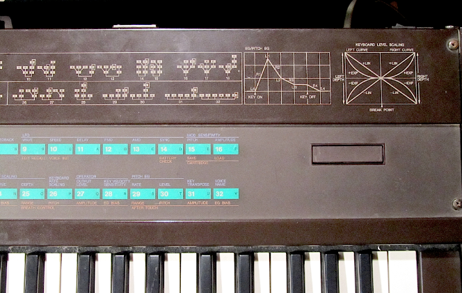

# FM-синтез звука в браузере. Часть 2

Рассмотрим FM-синтез на реальном примере. Сделаем эмулятор синтезатора Yamaha DX7 и добавим в него возможность читать картриджы с инструментами.

первая часть статьи здесь - https://habr.com/ru/articles/1052640/

## Немного о синтезаторе

Yamaha DX7 появился в 1983г. За счёт широких возможностей настройки звуков и низкой цены стал очень широко применяться. Половина поп-музыки 80-х годов прошлого века написана с его использованием.

Внутри устройства 6 генераторов синусоиды. Они могут соединяться друг с другом в 32 презаданные схемы (на картинке синтезатора выше они нарисованы на корпусе).
Каждый генератор имеет собственную частоту (кратную нажатой клавише или постоянную) и огибающую. 
При соединении генераторы создают фазовую модуляцию, что позволяет менять звук в широких пределах.

Подробней о внутреннем устройстве Yamaha DX7 можно прочитать здесь - https://www.muzines.co.uk/search/understanding%20the%20dx7

За прошедшее время для этого синтезатора наделали несметное количество инструментов от гитар с органами до барабанов. Если погуглить то можно найти достаточно много с хорошим звучанием.

## План

## Реализация

Формат файлов картриджей с инструментами (обычно это *.syx) можно посмотреть здесь - https://github.com/asb2m10/dexed/blob/master/Documentation/sysex-format.txt

## Заключение

https://github.com/surikov/webaudiopluginexample/tree/main/dx7

